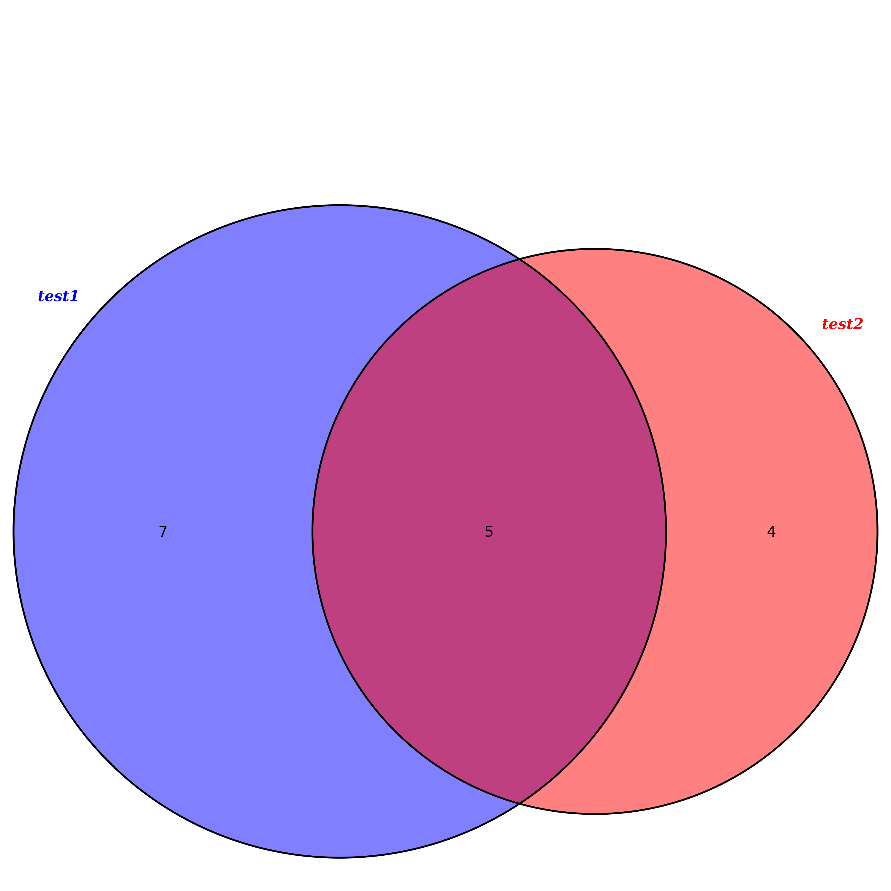
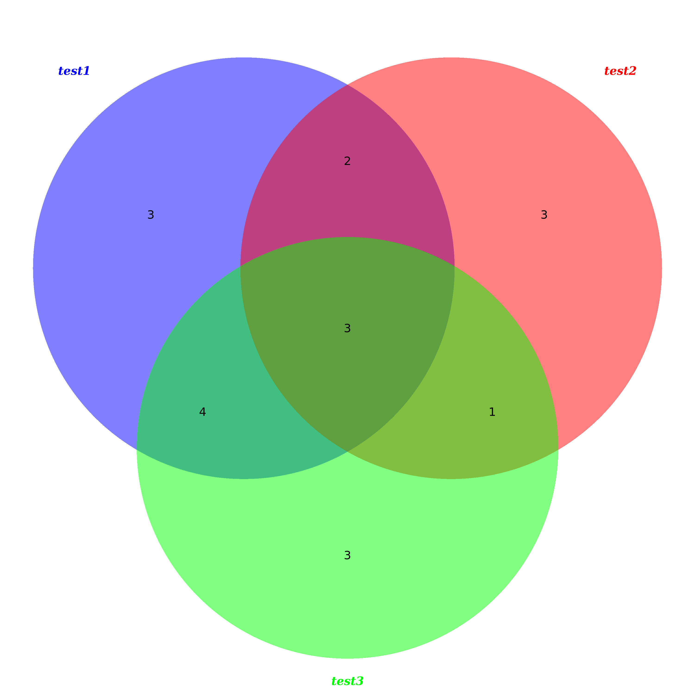
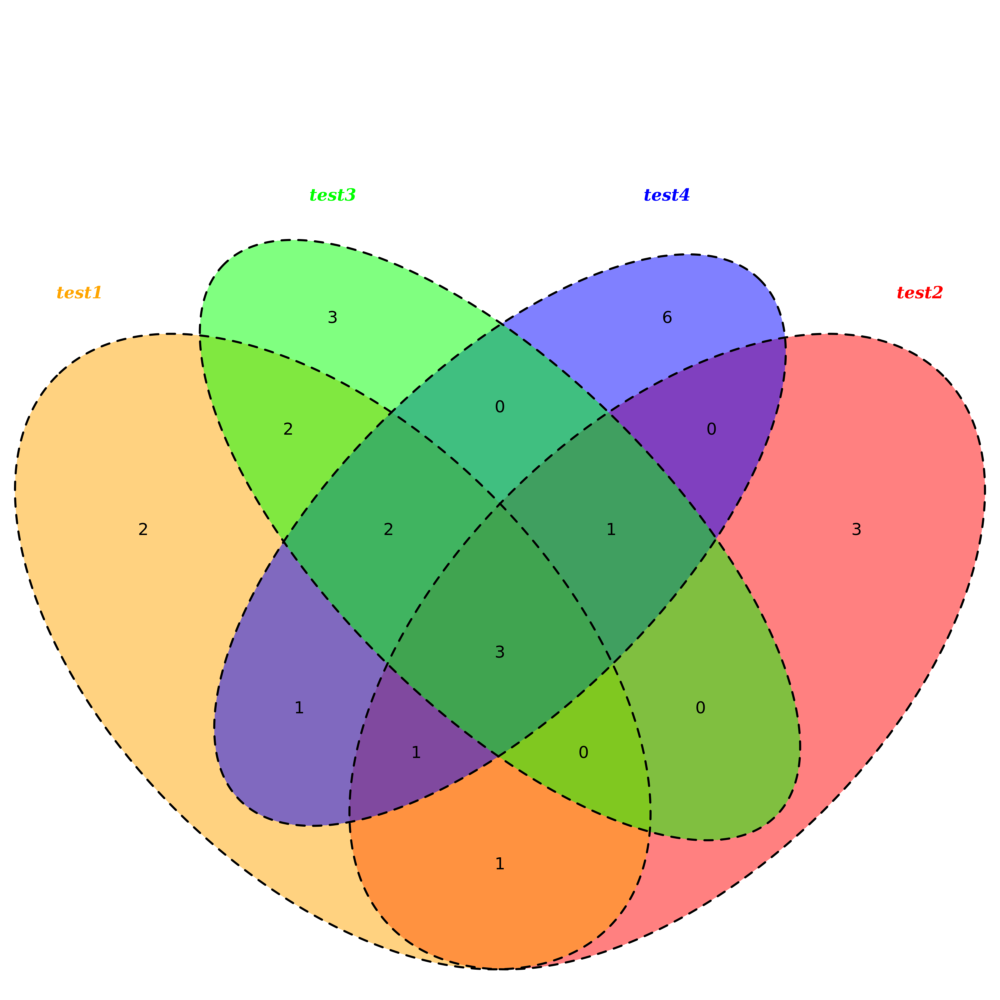
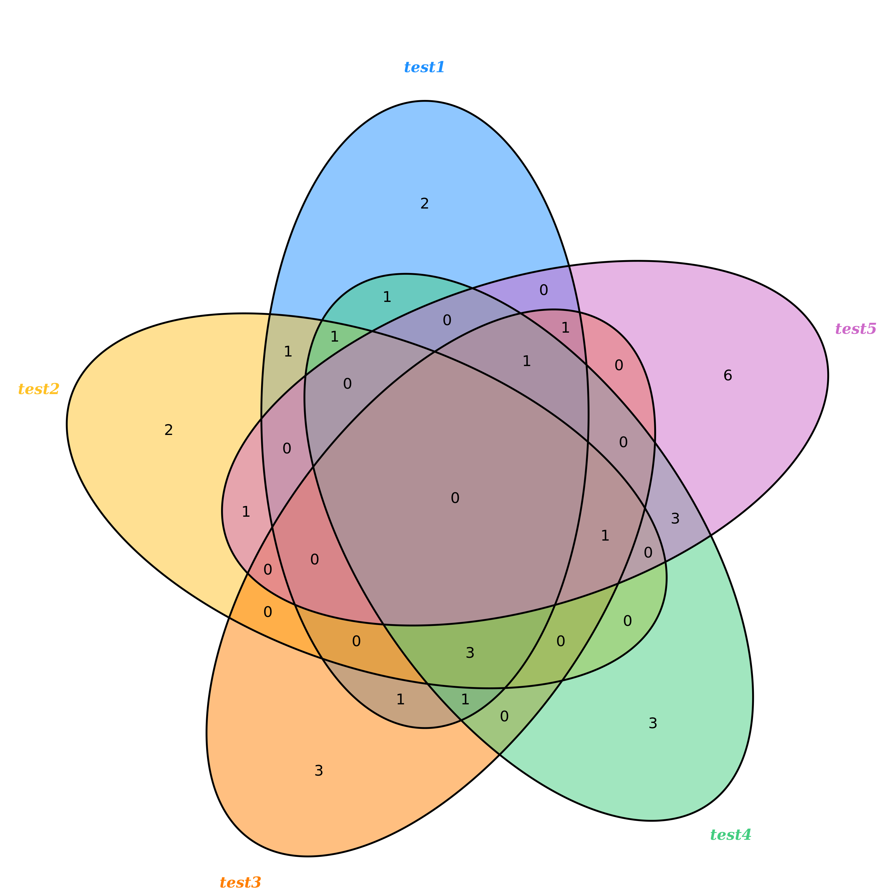
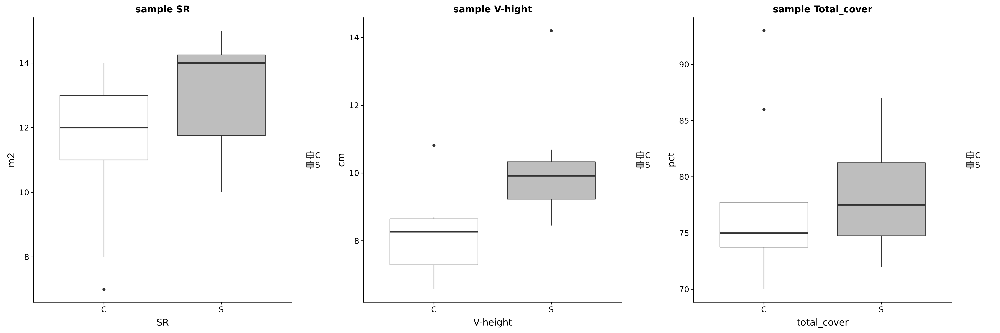

# R_stuff

01 mean
02 spearman


# 07. hist vs ggplot2 geom_histogram
see https://www.jianshu.com/p/16e2022c025d
```
data = read.csv("C:\\Users\\cy006\\Desktop\\01.R_test.csv", header=T)

ID = c(0,1,2,3,4,5)

Gender = c('male','female','male','female','male','female')

Height = c(178,156,170,158,168,155)

次数直方图或频数直方图，

hist(Height,freq = T)

频率直方图

hist(Height,freq = F)
NO.5
install.packages("ggplot2")
library(ggplot2)

ggplot(data, aes(x=Height, y=..count..  )) + geom_histogram(stat="bin", binwidth = 4, colour="black", fill="white")
ggplot(data, aes(x=Height, y=..density..)) + geom_histogram(stat="bin", binwidth = 4, colour="black", fill="white")
```

# R_Graphics_Cookbook.R

is a book note of the "R Graphics Cookbook", learning ...

# ggplot violin graph

igblast.result.visualization.R

for example
```
Rscript igblast.result.visualization.R
# may generate a pdf file with violin plot.
```

# R Graphics Cookbook learning

R_Graphics_Cookbook.2.R is a note book.

# Venn diagram
see: https://www.jianshu.com/p/05f4bae28443
Rscript venn.R \<file1\> \<file2\> ...





# basic boxplot
Rscript ggplot_boxplot_basic.R \<file\>

# geom_boxplot
Rscript geom_boxplot.R \<boxplot.data.txt\> ... 


# correlation.R
there are two scripts to draw correlation graph.
correlation.point.R
correlation.point.log.R
